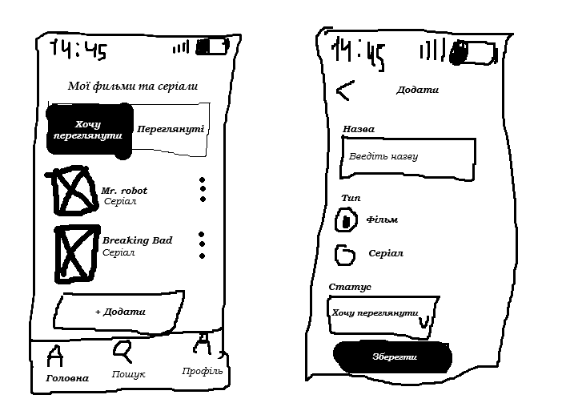

Варіант 15 — Трекер фільмів і серіалів

1. Планування: 
- Користувач повинен мати можливість створювати список фільмів і серіалів та розподіляти їх на переглянуті й бажані до перегляду.

2. Аналіз вимог:
- Як користувач, я хочу додавати фільми та серіали до списку, щоб зберігати те, що хочу переглянути. (Must have)
- Як користувач, я хочу позначати фільм або серіал як переглянутий, щоб відстежувати переглянутий контент. (Must have)
- Як користувач, я хочу видаляти фільми та серіали зі списку, щоб прибирати непотрібні.
- Як користувач, я хочу бачити список бажаних до перегляду фільмів і серіалів, щоб швидко обрати, що подивитися.
- Як користувач, я хочу бачити список уже переглянутих фільмів і серіалів, щоб пам’ятати, що я вже дивився.

3. Дизайн: 

4. Реалізація (Псевдокод):
function addMovie(title, type, status):
    if title is empty:
        return "Помилка: введіть назву"

    item = createItem(title, type, status)
    movieList.add(item)

    return "Фільм або серіал додано"

5. Тестування:
- 1. Назва: `Інтерстеллар`, тип: `Фільм`, статус: `Хочу переглянути` - Фільм успішно додається до списку
- 2. Назва: порожня, тип: `Фільм`, статус: `Хочу переглянути` - Виводиться помилка: `Введіть назву`
- 3. Назва: `Breaking Bad`, тип: `Серіал`, статус: `Переглянуто` - Серіал успішно додається до списку переглянутих

6. Висновки:
Для цього проєкту найкраще підходить модель Agile, оскільки вона дозволяє поступово розробляти застосунок і швидко вносити зміни. У майбутньому можна легко додавати нові функції, наприклад оцінювання фільмів, пошук або сортування. Waterfall і Spiral для такого невеликого проєкту були б складнішими та менш зручними.
